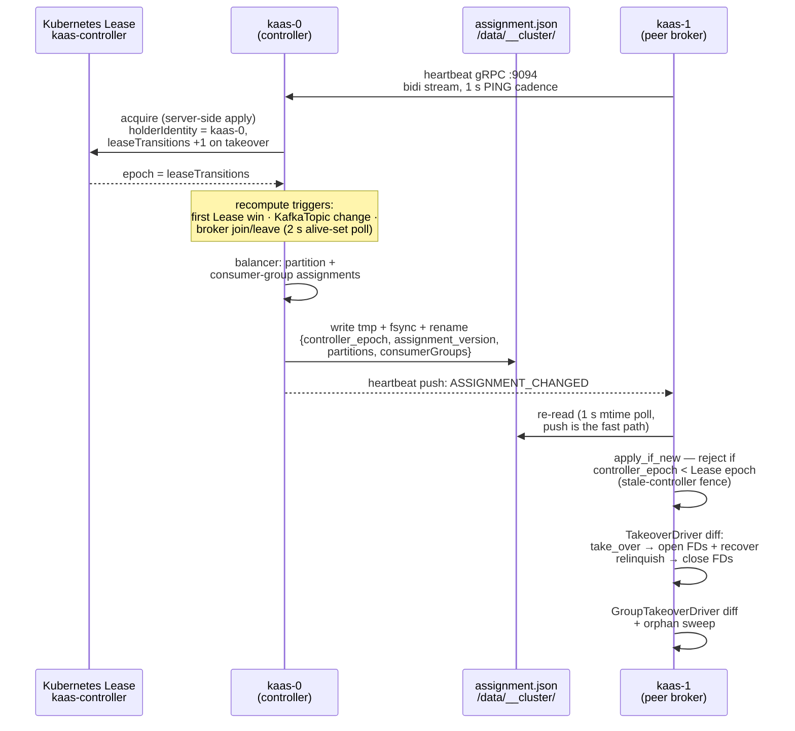

# Controller, leases & assignment.json

Controller election via a Kubernetes Lease, and `assignment.json` on the shared volume as the single source of truth for partition leadership.

The "controller" is just a broker holding the `kaas-controller` Lease — there
is no separate process and no Raft quorum. The Lease's `leaseTransitions`
counter is the cluster's epoch source: it increments exactly when the holder
changes, and a releasing controller re-sends it so the epoch fence never
rewinds.

The controller also mirrors each written assignment into the
`KafkaClusterAssignments` CR — a fire-and-forget debug surface for `kubectl`;
brokers never read it. There is no per-partition Lease: the singleton
controller Lease is the only Kubernetes coordination primitive, and everything
downstream of it travels through `assignment.json` on the shared volume.

## What the controller does

The controller's extra responsibilities, all in `crates/kaas-controller`:

- **Observes peer brokers** via heartbeat gRPC (`proto/heartbeat.proto`,
  served by `heartbeat_server.rs`). A broker that stops heartbeating ages out
  of the alive set — there is no controlled-shutdown RPC; the controller
  learns of a departure by timeout and rebalances reactively (gh #77).
- **Computes assignments** — partition leadership and consumer-group
  placement — in `balancer.rs`.
- **Writes `assignment.json`** epoch-prefixed, tmp + fsync + rename
  (`assignment_writer.rs`). `Coordinator::set_assignment` on every broker
  rejects writes whose epoch is stale, so a deposed controller that comes
  back from a GC pause can't roll the cluster backwards — the race is
  pinned down by `crates/kaas-controller/tests/stale_controller_race.rs`.
- **Mirrors to Kubernetes** (`k8s_mirror.rs`) for `kubectl get
  kafkaclusterassignments` diagnostics only.

## When it recomputes

| Trigger | Wired via |
|---|---|
| First win of the controller Lease | initial recompute |
| `KafkaTopic` CR add / modify / delete | topic-watch callback → `TopicChangeNotifier` (gh #74, `bins/kaas/src/cluster.rs`) |
| Broker joins or leaves the alive set | broker-set watcher, 2 s alive-set poll (gh #77, `bins/kaas/src/cluster.rs`) |

The alive set the balancer feeds on is *EndpointSlice-ready ∩
heartbeat-connected*, falling back to registry-only while a fresh controller
waits for brokers to dial in — so a controller elected mid-rollout doesn't
compute an empty assignment.

## How peers follow

Non-controller brokers watch `assignment.json` via file notification plus a
1 s poll (`crates/kaas-broker/src/coordinator.rs`); the heartbeat stream's
`ASSIGNMENT_CHANGED` push is the fast path, the poll the backstop. On every
accepted assignment the `TakeoverDriver` opens or relinquishes partitions in
the storage engine to match (see [File-handle
ownership](./file-handles.md)), and the `GroupTakeoverDriver` does the same
for consumer groups (see [Consumer-group
coordination](./consumer-groups.md)).

Everything that needs a leadership answer — the Metadata response, the
Produce/Fetch ownership check, `/healthz`'s `partitions_led` — sources from
the broker `Coordinator`'s view of `assignment.json`. There is no second
authority to disagree with (gh #75).

## Local-dev mode

When `MY_POD_NAME` is unset (`bins/kaas/src/main.rs`), the cluster runtime
isn't started at all: storage flips to in-memory and the local-lease shim
(`crates/kaas-broker/src/local_lease.rs`) answers "yes, I lead" for every
partition. This is a dev-loop convenience, not a single-node production
mode — nothing is persisted.
