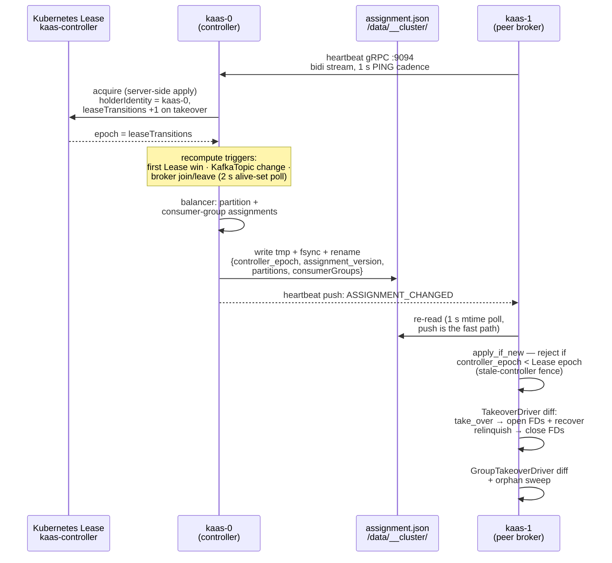

# Controller, leases & assignment.json

Controller election via a Kubernetes Lease, and `assignment.json` on the shared volume as the single source of truth for partition leadership.

The "controller" is just a broker holding the `kaas-controller` Lease — there
is no separate process and no Raft quorum. The Lease's `leaseTransitions`
counter is the cluster's epoch source: it increments exactly when the holder
changes, and a releasing controller re-sends it so the epoch fence never
rewinds.

The controller also mirrors each written assignment into the
`KafkaClusterAssignments` CR — a fire-and-forget debug surface for `kubectl`;
brokers never read it. There is no per-partition Lease: the singleton
controller Lease is the only Kubernetes coordination primitive, and everything
downstream of it travels through `assignment.json` on the shared volume.
