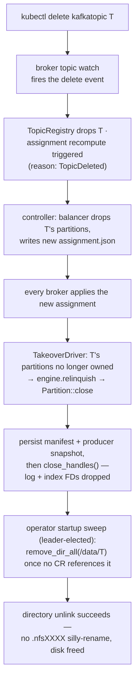

# File-handle ownership & takeover

Only a partition's current leader holds open file descriptors — the rule that makes deletes actually free disk on NFS instead of silly-renaming.

On NFS, removing a file that any client still holds open "silly-renames" it
into a `.nfsXXXX` entry that pins the parent directory until every FD is
closed — so segment cleanup would stop reclaiming disk, and directory removal
would loop on `EBUSY`. kaas's contract: followers keep segment state as
metadata only (size, base offset, epoch from the filename); FDs are opened on
`take_over` and dropped on `relinquish`/`close`.

## Topic delete: the handle-close path

The same ownership rule pays off in day-to-day operation, not just deletes:
segment retention, `DeleteRecords`, and segment-roll cleanup all unlink files
on the leader — the only broker with the FDs open — so removal genuinely frees
space instead of leaving `.nfsXXXX` ghosts. Partition open at startup *stats*
segments without opening handles; the FDs materialize only when
`TakeoverDriver` calls the engine's take-over (gh #76).

## Takeover and relinquish

When `assignment.json` moves a partition:

- **New leader**: `take_over` opens the log + index handles, restores
  `producer-state.snapshot`, and runs segment recovery — scanning the active
  segment forward to the first malformed batch boundary and reconciling the
  manifest's possibly-stale `highWatermark` against what's actually on disk.
  Recovery runs at takeover time precisely *because* the manifest is allowed
  to lag (see [Storage engine hot path](./storage-hot-path.md)).
- **Old leader**: `relinquish` persists the manifest and producer snapshot
  one last time, then closes the handles. The epoch-prefixed segment
  filenames guarantee that even a *missed* relinquish (crashed pod) can't
  corrupt the new leader's log — a stale writer's segments simply belong to
  a dead epoch.

## Manifest + producer snapshot

Two sibling files ride along with every partition's segments:

- `manifest.json` — `(epoch, highWatermark, logStartOffset)`, written tmp +
  fsync + rename. Persisted on partition open and on close/relinquish — not
  per append, and not on segment roll — so recovery treats the log itself as
  authoritative.
- `producer-state.snapshot` — the idempotent-producer dedupe window
  (`crates/kaas-storage/src/producer_snapshot.rs`), written on segment roll
  and relinquish, restored on take-over. Without it a leadership move would
  drop the per-PID sequence rings and in-flight producer retries would be
  misclassified as `OUT_OF_ORDER_SEQUENCE_NUMBER` instead of duplicates.

## Graceful SIGTERM drain

The shutdown path in `bins/kaas/src/main.rs` (gh #61, gh #139) relinquishes
every open partition *before* flushing manifests — persisting each manifest
one final time **and** closing the active segment's handles, so the next
leader doesn't inherit a silly-rename fight on takeover. Partition keys are
parsed from the right so slash-bearing topic names split correctly. Manifest
flushing stays as defence-in-depth after the relinquish pass.

There is no controlled-shutdown RPC: after the drain, the controller notices
the broker's heartbeats stopping and rebalances reactively. A proactive "I'm
draining, move my partitions first" hint is an open follow-up.
