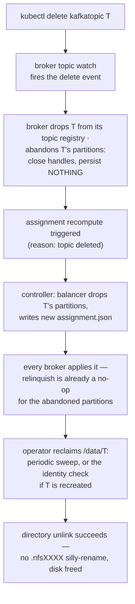

# File-handle ownership & takeover

Only a partition's current leader holds open file descriptors — the rule that makes deletes actually free disk on NFS instead of silly-renaming.

In Apache Kafka, log dirs are broker-local, so file handles are
nobody's problem: every replica holds its own segments open, and
deleting a segment is a local unlink no other machine can observe. On
kaas's shared volume, every broker mounts the *same* partition
directories the [storage hot path](./storage-hot-path.md) writes — and
NFS adds a rule local filesystems don't have: removing a file that any
client still holds open "silly-renames" it into a hidden `.nfsXXXX`
entry that pins the parent directory (`EBUSY` on removal) until every
descriptor closes. Left unmanaged, segment cleanup stops reclaiming
disk and topic deletion loops forever.

kaas's answer extends its single-writer-per-partition model to file
descriptors: **only a partition's current leader holds open log and
index handles**. Every other broker knows the segments as metadata
only — size, base offset, and leader epoch, all readable from the
filename without opening the file. Handles are opened on takeover and
dropped on relinquish or close; even opening a partition at broker
startup only *stats* the segment files.

The payoff is day-to-day, not just in failure cases: segment retention,
`DeleteRecords`, and segment-roll cleanup all unlink files on the
leader — the only broker with the descriptors open — so removal
genuinely frees space instead of leaving `.nfsXXXX` ghosts.

## Takeover and relinquish

When `assignment.json` moves a partition (the
[controller chapter](./controller.md) covers who writes it and why):

- **New leader**: takeover opens the log + index handles, restores the
  idempotent-producer snapshot, and runs segment recovery — scanning
  the active segment forward to the first malformed batch boundary and
  reconciling the manifest's possibly-stale high watermark against
  what's actually on disk. Recovery runs at takeover time precisely
  *because* the manifest is allowed to lag (see
  [Storage engine hot path](./storage-hot-path.md)).
- **Old leader**: relinquish persists the manifest and producer
  snapshot one last time, then closes the handles. The epoch-prefixed
  segment filenames guarantee that even a *missed* relinquish (crashed
  pod) can't corrupt the new leader's log — a stale writer's segments
  simply belong to a dead epoch.

## Manifest + producer snapshot

Two sibling files ride along with every partition's segments:

- `manifest.json` — `(epoch, highWatermark, logStartOffset)`, written
  temp + fsync + rename. Persisted on partition open and on
  close/relinquish — not per append, and not on segment roll — so
  recovery treats the log itself as authoritative.
- `producer-state.snapshot` — the idempotent-producer dedupe window,
  written on segment roll and relinquish, restored on takeover. Without
  it a leadership move would drop the per-producer sequence history,
  and in-flight producer retries would be misclassified as
  `OUT_OF_ORDER_SEQUENCE_NUMBER` instead of duplicates.

## Topic delete: the handle-close path

Note the asymmetry between *abandon* and *relinquish*. A relinquish is
a leadership handover: persist the manifest and producer snapshot, then
release. A delete is not — the topic is gone, and the operator reclaims
its directory by renaming it aside, so a recreated topic of the same
name gets a **fresh directory at the same path**. A well-meaning close
racing that sequence lands the dead incarnation's high watermark and
dedupe window in the new incarnation's directory. Abandon therefore
drops the handles and writes nothing, and dropping the in-memory
partition forces the next takeover to re-open from disk rather than
keep serving the deleted topic's state.

Both the delete and the recreate arrive on the *same* watch stream, so
the abandon is ordered before the recreate's apply — no coordination
needed. (What protects a recreated topic even *without* that ordering
is the topic-identity stamp — see
[the RWX substrate contract](./nfs-substrate.md).)

## Graceful SIGTERM drain

The broker's shutdown path relinquishes every open partition *before*
flushing manifests — persisting each manifest one final time **and**
closing the active segment's handles, so the next leader doesn't
inherit a silly-rename fight on takeover. Manifest flushing stays as
defence-in-depth after the relinquish pass.

There is no controlled-shutdown RPC: after the drain, the controller
notices the broker's heartbeats stopping and rebalances reactively. A
proactive "I'm draining, move my partitions first" hint is an open
follow-up.

This whole chapter is one discipline in service of a larger contract —
the rules any code touching the shared volume must obey. That contract
is the next chapter: [The RWX substrate contract](./nfs-substrate.md).

## Implementation notes (for contributors)

- The leader-only FD rule is gh #76: `TakeoverDriver` calls the
  engine's take-over, which opens handles before recovery; relinquish
  closes them. Partition open at startup stats without opening.
- `abandon_topic` ≠ `relinquish` (gh #219) — don't "unify" them:
  abandon must close handles and persist **nothing**, or a late close
  writes the dead incarnation's HWM and dedupe window into a recreated
  topic's directory.
- The producer snapshot lives in
  `crates/kaas-storage/src/producer_snapshot.rs`.
- The SIGTERM drain is in `bins/kaas/src/main.rs` (gh #61, gh #139);
  partition keys are parsed from the right so slash-bearing topic names
  split correctly.
