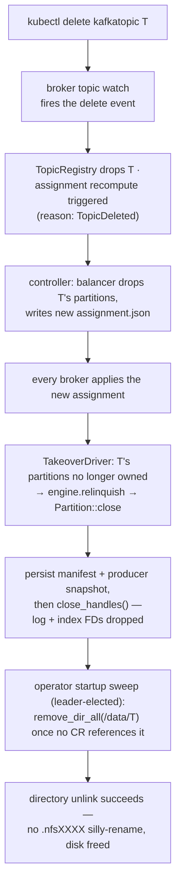

# File-handle ownership & takeover

Only a partition's current leader holds open file descriptors — the rule that makes deletes actually free disk on NFS instead of silly-renaming.

On NFS, removing a file that any client still holds open "silly-renames" it
into a `.nfsXXXX` entry that pins the parent directory until every FD is
closed — so segment cleanup would stop reclaiming disk, and directory removal
would loop on `EBUSY`. kaas's contract: followers keep segment state as
metadata only (size, base offset, epoch from the filename); FDs are opened on
`take_over` and dropped on `relinquish`/`close`.

## Topic delete: the handle-close path

The same ownership rule pays off in day-to-day operation, not just deletes:
segment retention, `DeleteRecords`, and segment-roll cleanup all unlink files
on the leader — the only broker with the FDs open — so removal genuinely frees
space instead of leaving `.nfsXXXX` ghosts. The graceful SIGTERM drain closes
every open partition the same way (relinquish, then manifest flush) so the
next leader never inherits a silly-rename fight.
