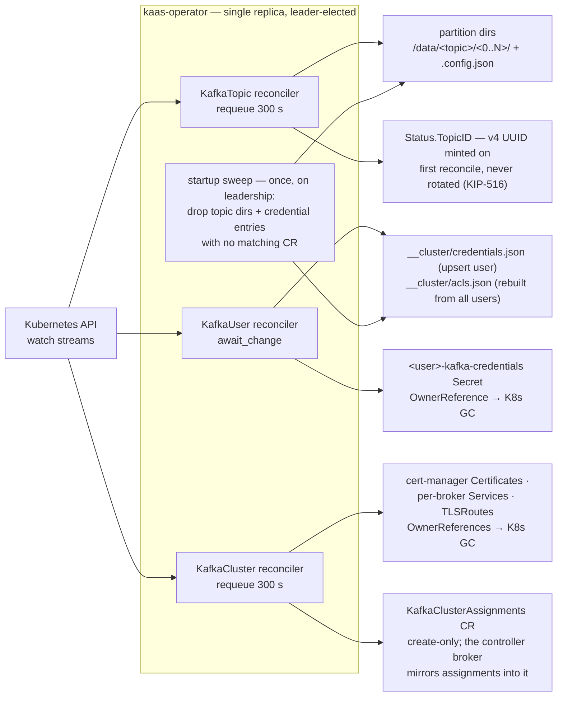

# Kubernetes integration

The four CRDs, their reconcilers, reconcile-time cleanup (no finalizers), and the broker's RBAC surface.

## Operator reconcile loops

One reconciler per CRD. None of them use cleanup finalizers — deleting a CR
never blocks on the operator being alive; owned Kubernetes resources carry
`OwnerReferences` so garbage collection is K8s-native, and on-disk leftovers
are reclaimed by a leader-elected sweep at operator startup.

Reconciler guard rails worth knowing:

- **KafkaTopic** refuses partition decrease (`Ready=False`, no filesystem
  mutation) — partitions only grow, matching Kafka semantics.
- **KafkaUser** with a missing referenced Secret parks on `await_change`
  instead of hot-looping.
- **KafkaClusterAssignments** has no reconciler at all: the operator only
  creates it (with an OwnerReference); its status is written fire-and-forget by
  the controller broker, and brokers never read it back.
- A CR with `deletionTimestamp` set is left untouched by the reconcilers;
  cleanup happens via K8s GC (owned resources) and the startup sweep (on-disk
  state).

On the broker side, the CRD surface is read-mostly — but not read-only:
`CreatePartitions` and `IncrementalAlterConfigs` patch `KafkaTopic` CRs
(`spec.partitions` / `spec.config`), which is why broker RBAC carries
`update,patch` on `kafkatopics` in addition to the read verbs
(`deploy/helm/kaas/templates/broker-rbac.yaml` — check it whenever a new
admin write path lands).

## The CRD surface

Four CRDs, typed in `crates/kaas-operator-api/src/` (kube-derive; `cargo
xtask gen-crds` regenerates the YAML into `deploy/crds/` and the chart).
`KafkaUser` mirrors Strimzi 1:1 for `spec.authentication` /
`spec.authorization` (gh #135), with two deliberate divergences:

- **Quota field naming**: `spec.quotas` uses
  `producerMaxByteRatePerBroker` / `consumerMaxByteRatePerBroker` where
  Strimzi says `producerByteRate` / `consumerByteRate`. The semantics are
  identical to Strimzi/Apache (KIP-13: quotas are per-broker; N brokers → N×
  cluster ceiling) — the kaas names just say so honestly at the CR level.
- **No group abstraction**: the pre-gh #135 `KafkaACL` / `KafkaUserGroup`
  CRs are gone. ACLs are authored inline on each KafkaUser's
  `spec.authorization.acls`; granting the same rule to N principals means
  repeating it on N CRs — the standard Strimzi-pattern trade.

### TopicID (KIP-516) — where it stands

The `KafkaTopic` controller mints a v4 UUID into `Status.TopicID` on first
reconcile and never rotates it, so a re-created topic gets a distinct ID —
Apache's contract. Honesty note about the other half: the broker-side
plumbing that would carry that UUID to the wire (`TopicWatcher` stashing
`Status.TopicID` into the topic registry) exists but **is not wired into the
production topic watch** — every registry entry currently carries the
all-zero sentinel, so Metadata v10+ serves nil topic IDs for all topics.
Clients treat that as "broker doesn't expose topic IDs" and fall back to
names. See the [KIP index](../compat/kip-index.md) for the tracked gap.

## Why there are no finalizers

Earlier versions used `kaas.rs/*-cleanup` finalizers that drained on CR
delete. ArgoCD's parallel cascade-delete then deadlocked a teardown: the
operator pod was deleted before its CRs, and every CR hung forever waiting
for a finalizer that nothing would ever clear. The replacement design:

- **Owned external resources** (Certificates, Services, TLSRoutes, Secrets)
  carry `OwnerReferences` — Kubernetes GC handles them with no operator
  involvement.
- **On-disk state** (topic dirs, credential entries) is reclaimed by the
  leader-elected **startup sweep** in `crates/kaas-operator-controllers/`,
  which drops anything on the volume with no matching CR.

Deleting the operator, the CRs, or both in any order can no longer wedge —
the cost is that on-disk cleanup happens at the *next operator start* rather
than synchronously with the delete.

## Readiness gate

Broker pods declare the `kaas.rs/PartitionsReady` readiness gate; the broker
patches its own pod condition (`crates/kaas-k8s/src/readiness.rs`) once the
partition directories it needs exist on the volume — keeping a broker out of
Service endpoints until the storage it serves from is actually in place.
