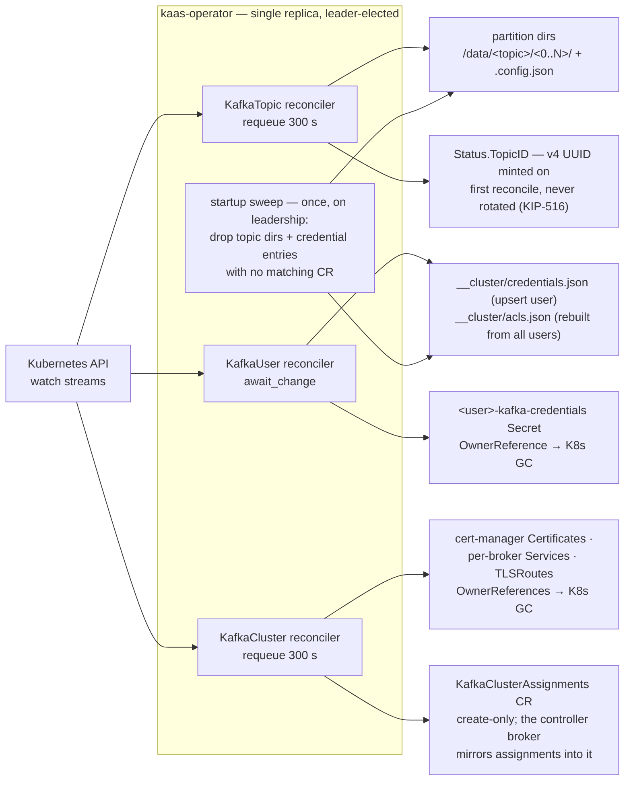

# Kubernetes integration

The four CRDs, their reconcilers, reconcile-time cleanup (no finalizers), and the broker's RBAC surface.

## Operator reconcile loops

One reconciler per CRD. None of them use cleanup finalizers — deleting a CR
never blocks on the operator being alive; owned Kubernetes resources carry
`OwnerReferences` so garbage collection is K8s-native, and on-disk leftovers
are reclaimed by a leader-elected sweep at operator startup.

Reconciler guard rails worth knowing:

- **KafkaTopic** refuses partition decrease (`Ready=False`, no filesystem
  mutation) — partitions only grow, matching Kafka semantics.
- **KafkaUser** with a missing referenced Secret parks on `await_change`
  instead of hot-looping.
- **KafkaClusterAssignments** has no reconciler at all: the operator only
  creates it (with an OwnerReference); its status is written fire-and-forget by
  the controller broker, and brokers never read it back.
- A CR with `deletionTimestamp` set is left untouched by the reconcilers;
  cleanup happens via K8s GC (owned resources) and the startup sweep (on-disk
  state).

On the broker side, the CRD surface is read-mostly — but not read-only:
`CreatePartitions` and `IncrementalAlterConfigs` patch `KafkaTopic` CRs
(`spec.partitions` / `spec.config`), which is why broker RBAC carries
`update,patch` on `kafkatopics` in addition to the read verbs.
