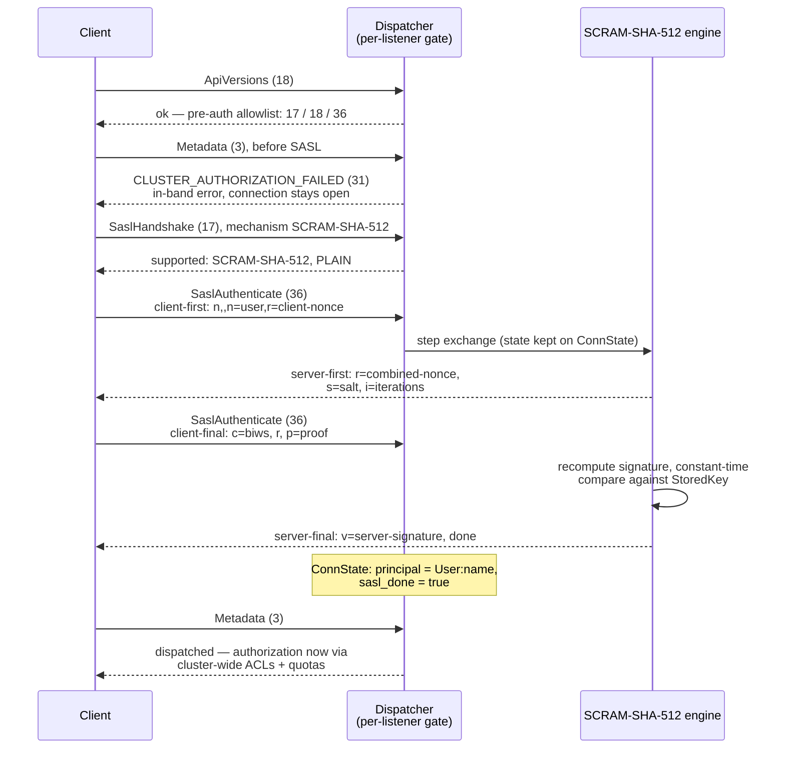

# Listeners, authentication, authorization

Strimzi-shaped listeners, per-listener authentication engines, and cluster-wide ACL and quota enforcement.

## The pre-auth gate on an authed listener

Each listener gets its own auth engine, selected by listener name. Anonymous
listeners use an allow-all engine (no SASL, no principal); on authenticated
listeners the dispatcher blocks every API except the pre-auth allowlist —
SaslHandshake (17), ApiVersions (18), SaslAuthenticate (36) — until the SASL
exchange completes:

An mTLS listener satisfies the same gate at the TLS handshake instead: the
server extracts the principal from the client certificate (through the
KIP-371 principal-mapping rules) and marks the connection authenticated before
any Kafka API arrives.

**Authentication is per-listener; authorization is cluster-wide.** Once a
principal is on the connection, Produce/Fetch and the admin surfaces consult
the single cluster-wide authorizer and quota checker — which is what lets an
anonymous `plain` listener and an authed SCRAM listener share one ACL/quota
policy.
