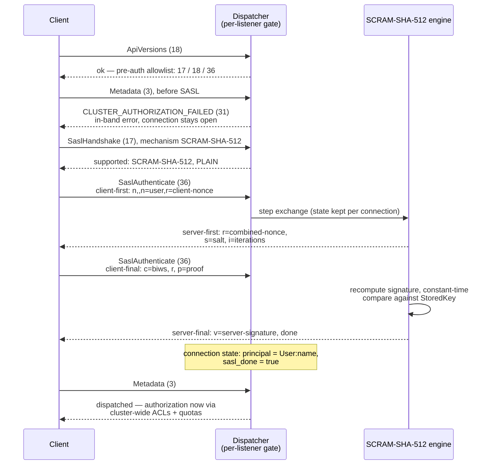

# Listeners, authentication, authorization

Strimzi-shaped listeners, per-listener authentication engines, and cluster-wide ACL and quota enforcement.

If you have configured Apache Kafka, you know the listener trinity —
`listeners`, `advertised.listeners`, `listener.security.protocol.map` —
with a cluster-wide authorizer and KIP-13 quotas layered on top. If you
have run Strimzi, you know its friendlier shape: an array of listeners,
each declaring its own port, type, TLS, and authentication. kaas adopts
the Strimzi shape 1:1 and keeps Apache Kafka's split intact:
**authentication is per-listener; authorization and quotas are
cluster-wide.**

Where the security metadata lives is the kaas difference. Apache Kafka
stores SCRAM credentials and ACLs in the metadata quorum, managed with
`kafka-configs.sh` / `kafka-acls.sh`; kaas manages users as Kubernetes
custom resources (`KafkaUser`, mirroring Strimzi's), which the operator
materializes into JSON files on the shared volume — part of the
CRs-as-metadata substitution from the
[introduction](../introduction.md). Brokers hot-reload those files: no
broker restart on user or ACL changes, and no Kubernetes API call on
the request path.

## Three orthogonal listener axes

Listeners are declared in the Helm chart (`.Values.listeners[]`); each
entry combines three independent axes:

- **`type`**: `internal` (in-cluster only) vs `external` (Gateway +
  cert-manager + per-broker hostnames).
- **`tls`**: `false` / `true`. `mtls` authentication implies
  `tls: true`; everything else is independent.
- **`authentication.type`**: `none` / `scram-sha-512` / `mtls` /
  `plain`. Each listener gets its own auth engine, selected by listener
  *name* — a free-form string the chart picks.

Running one listener per combination is normal — e.g. keep `plain`
anonymous for in-cluster bench/UI traffic and add an `authed` SCRAM
listener side by side, both governed by the same cluster-wide ACLs:

```yaml
listeners:
  - name: plain            # anonymous, in-cluster
    port: 9092
    type: internal
    tls: false
    authentication:
      type: none
  - name: authed           # SASL required, same ACL policy
    port: 9095
    type: internal
    tls: false
    authentication:
      type: scram-sha-512
```

### Per-listener Metadata advertisement

Each broker endpoint carries a per-listener port map, and the Metadata
handler answers with the port matching *the listener the request
arrived on*: a client that bootstrapped on `:9095` gets `:9095` back,
not `:9092`. Without this, an authed-listener client was handed the
anonymous listener's port in the Metadata response and looped on SCRAM
retry against a listener that never asks for SASL.

## The pre-auth gate on an authed listener

Anonymous listeners use an allow-all engine (no SASL, no principal); on
authenticated listeners the dispatcher blocks every API except the
pre-auth allowlist — SaslHandshake (17), ApiVersions (18),
SaslAuthenticate (36) — until the SASL exchange completes:



An mTLS listener satisfies the same gate at the TLS handshake instead:
the server extracts the principal from the client certificate (through
the KIP-371 principal-mapping rules below) and marks the connection
authenticated before any Kafka API arrives.

Once a principal is on the connection, Produce/Fetch and the admin
surfaces consult the single cluster-wide authorizer and quota checker —
which is what lets an anonymous `plain` listener and an authed SCRAM
listener share one ACL/quota policy.

## Authorization

The cluster-wide authorizer is wired by `KAAS_AUTHORIZATION_TYPE`:
empty (default) means allow-all; `simple` enables ACL evaluation
against `/data/__cluster/acls.json`. `KAAS_SUPER_USERS`
(comma-separated `User:foo,User:bar`) wraps whichever authorizer was
picked in a super-user early-allow layer.

ACLs and credentials are **operator-materialized**: `KafkaUser` CRs
become entries in `credentials.json` + `acls.json`, which brokers
hot-reload. `KAAS_AUTH_DISABLED=true` switches the whole subsystem off
for dev setups.

### mTLS principal mapping (KIP-371)

kaas parses Apache's `ssl.principal.mapping.rules` syntax — regex over
the full subject DN with `$1`/`$2` back-references and `/L`/`/U` case
postfixes; first matching rule wins, `DEFAULT` returns the CN. The
server applies the mapper to the client certificate's subject DN during
the TLS handshake. Parse errors fail at startup, so a chart-config typo
is a crash-loop with a clear message, not every certificate silently
mapping to its CN.

## Quotas

The quota checker defaults to no-op and switches to real token buckets
when auth is enabled. Two properties matter:

- **Quotas are orthogonal to authorization** — they fire even with
  authorization off, and per KIP-13 they are **per-broker**: with N
  brokers the effective cluster ceiling is N × the configured rate (the
  CRD field names say so explicitly — see
  [Kubernetes integration](./kubernetes.md)).
- **Debt-carry**: the token bucket carries negative balances forward as
  debt rather than clamping at zero. With clamping, N concurrent
  clients each saw a "full" bucket and burst at N× the configured rate
  before throttling engaged — the observed 16-vs-10 MiB/s gap under
  bench load. Removing the clamp matches Apache's behaviour.

Throttle decisions surface as `throttle_time_ms` in responses. kaas
computes and returns it but does not yet mute the connection channel
afterwards (KIP-219's enforcement half) — cooperative clients throttle
themselves; adversarial ones are a known gap tracked in the
[KIP index](../compat/kip-index.md).

## Implementation notes (for contributors)

- Listener array → `KAAS_LISTENERS` JSON env: gh #126. The connection's
  listener name is carried by
  `crates/kaas-protocol/src/connstate.rs` (free-form string, no
  predefined constants — the chart picks the names).
- Per-listener auth engines live in `crates/kaas-auth`, selected per
  listener name; the pre-auth gate is enforced in the protocol
  dispatcher (gh #124).
- Per-listener Metadata port advertisement and quota debt-carry:
  gh #125. Debt-carry is pinned by the
  `multi_client_contention_carries_debt` unit test next to the token
  bucket (`crates/kaas-auth/src/quota.rs`).
- ACL evaluation: `crates/kaas-auth/src/acls.rs`.
- Principal mapping: `crates/kaas-auth/src/principal_mapping.rs`
  (gh #43).
