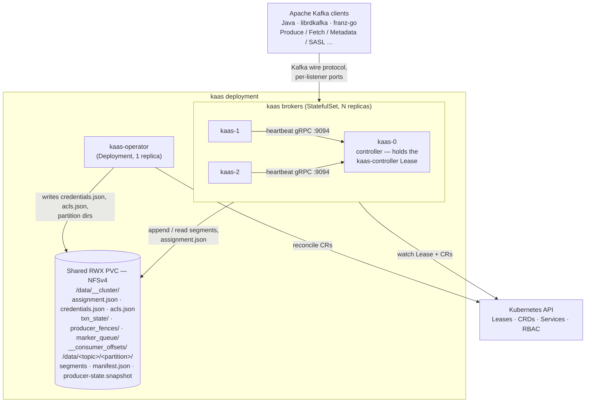

# System overview

The moving parts at a glance: broker pods, the operator, the shared RWX
volume, the Kubernetes API — and where Apache Kafka clients plug in.

A production Apache Kafka cluster is brokers plus distributed-systems
machinery: a KRaft controller quorum (ZooKeeper before it) electing
leaders and replicating a metadata log, ISR-tracked replicas guarding
every partition, and internal topics carrying offsets and transaction
state. kaas keeps Kafka's wire contract — Apache Kafka clients (Java,
librdkafka, franz-go) connect unchanged, verified against the Kafka 3.7
parity matrix (see [Part II](../compat/wire-protocol.md)) — but replaces
that machinery with Kubernetes primitives and a shared filesystem.
Three substitutions carry the whole design:

1. **KRaft / ZooKeeper quorum → a Kubernetes Lease plus custom
   resources.** Controller election is a Lease; topics, users, and ACLs
   live in CRs instead of a metadata log.
2. **Replication / ISR → a single writer per partition** on a shared
   `ReadWriteMany` volume. Durability comes from the storage substrate,
   not from followers, and epoch fencing guards against split brain
   where ISR membership would.
3. **Internal topics (`__consumer_offsets`, `__transaction_state`) →
   plain JSON files** on the same shared volume.

Kubernetes is the only control plane — there is no peer gossip protocol
and no replicated state machine. The full rationale for each divergence
lives in [Non-goals](../compat/non-goals.md).

## The brokers

A `StatefulSet` with stable pod ordinals (`kaas-0`, `kaas-1`, …). Each
pod is a single broker process that:

- serves client traffic on its listeners — the Helm chart declares one
  per `listeners[]` entry, each with its own TLS and authentication
  settings;
- serves peer heartbeats on `:9094` (gRPC, controller-bound);
- exposes `/healthz` + `/readyz` on `:8080` (kubelet probes +
  diagnostics);
- mounts the shared RWX volume at `/data` — every broker sees every
  other broker's segment files, which is what makes leadership takeover
  a file open, not a data copy.

## The operator

A `Deployment`, single replica, leader-elected. It reconciles four CRDs
into on-disk config files and Kubernetes plumbing:

| CRD | Materialized as |
|---|---|
| `KafkaCluster` | external-listener plumbing: cert-manager Certificates, per-broker Services, Gateway TLSRoutes |
| `KafkaTopic` | `/data/<topic>/<partition>/` directories + `.config.json`; `Status.TopicID` UUID (KIP-516) |
| `KafkaUser` | entries in `/data/__cluster/credentials.json` + `acls.json` |
| `KafkaClusterAssignments` | nothing — read-only debug mirror, written by the controller broker |

The operator does **not** sit on the data path: brokers serve traffic
even if the operator is crash-looping. Why that holds is the subject of
[Broker/operator runtime independence](./runtime-independence.md).

## The shared substrate

NFSv4 in production (`csi-driver-nfs` or similar), local-path for
single-node dev. kaas asks three things of the filesystem, and leans on
each in a specific place:

1. **Same-directory rename atomicity** — the manifest and every cluster
   file are written tmp + fsync + rename.
2. **Fsync durability** — the group-commit cycle's `sync_all()` is the
   `acks=all` promise.
3. **Close-to-open consistency** — a transaction-state file written and
   closed by one broker reads back complete on the next broker that
   opens it.

The full contract — what those three guarantees do and don't buy, and
the rules for code that touches the volume — is [The RWX substrate
contract](./nfs-substrate.md); storage requirements and the provider
matrix are covered in [Operations](../operations/storage.md).

## Reading order

Part I follows the three substitutions.

Start with [Broker/operator runtime
independence](./runtime-independence.md) — the ground rule that shapes
everything else: the operator provisions, brokers serve, and the hot
path never waits on Kubernetes. [Controller, leases &
assignment.json](./controller.md) then covers the first substitution:
how a Lease election plus one JSON file replace the KRaft quorum as the
source of partition leadership.

The next four chapters are the second substitution — the data plane.
[Storage engine hot path](./storage-hot-path.md) shows how a broker
makes `acks=all` affordable on networked storage; [File-handle
ownership](./file-handles.md) how leadership moves between brokers as a
file open; [The RWX substrate contract](./nfs-substrate.md) the three
filesystem guarantees all of it stands on; [The volume
pool](./volume-pool.md) how the substrate itself scales out.

[Consumer-group coordination](./consumer-groups.md) and [Transactions &
idempotence](./transactions.md) are the third substitution: what Kafka
keeps in `__consumer_offsets` and `__transaction_state`, kaas keeps in
JSON files on the shared volume.

The closing chapters face the operator of the cluster: [Listeners,
authentication, authorization](./listeners-auth.md), [Kubernetes
integration](./kubernetes.md), [Honest readiness & rollout
pacing](./readiness-rollout.md), and
[Observability](./observability.md).

## Implementation notes (for contributors)

- The broker binary is `bins/kaas`; the operator is
  `bins/kaas-operator`.
- Listeners reach the broker as the `KAAS_LISTENERS` JSON env var; the
  chart synthesizes one entry per `.Values.listeners[]` item (gh #126).
- Fixed ports: 8080 health, 9094 inter-broker heartbeat gRPC.
