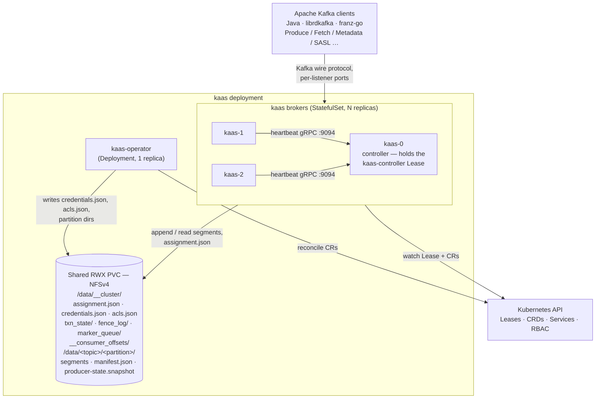

# System overview

The moving parts at a glance: broker pods, the operator, the shared RWX PVC, the Kubernetes API — and where Apache Kafka clients plug in.

Kubernetes is the only control plane — there is no peer gossip protocol and no
replicated state machine. Three deliberate divergences from Apache Kafka: no
KRaft (controller election is a Kubernetes Lease), no replication/ISR
(single-writer-per-partition on shared storage), and no `__transaction_state`
internal topic (slot-sharded JSON files on the shared volume). The full
rationale for each lives in [Non-goals](../compat/non-goals.md); Apache Kafka
clients (Java, librdkafka, franz-go) connect unchanged, verified against the
Kafka 3.7 parity matrix (see [Part II](../compat/wire-protocol.md)).

## Broker — `bins/kaas`

A `StatefulSet` with stable pod ordinals (`kaas-0`, `kaas-1`, …). Each pod is
a single broker process that:

- serves client traffic on the listeners declared via the `KAAS_LISTENERS`
  JSON env — the Helm chart synthesizes one entry per `.Values.listeners[]`
  item (gh #126);
- serves peer heartbeats on `:9094` (gRPC, controller-bound);
- exposes `/healthz` + `/readyz` on `:8080` (kubelet probes + diagnostics);
- mounts the shared RWX PVC at `/data` — every broker sees every other
  broker's segment files, which is what makes takeover a file-open, not a
  data copy.

## Operator — `bins/kaas-operator`

A `Deployment`, single replica, leader-elected. It reconciles four CRDs into
on-disk config files and Kubernetes plumbing:

| CRD | Materialized as |
|---|---|
| `KafkaCluster` | external-listener plumbing: cert-manager Certificates, per-broker Services, Gateway TLSRoutes |
| `KafkaTopic` | `/data/<topic>/<partition>/` directories + `.config.json`; `Status.TopicID` UUID (KIP-516) |
| `KafkaUser` | entries in `/data/__cluster/credentials.json` + `acls.json` |
| `KafkaClusterAssignments` | nothing — read-only debug mirror, written by the controller broker |

The operator does **not** sit on the data path: brokers serve traffic even if
the operator is crash-looping. Why that holds is the subject of
[Broker/operator runtime independence](./runtime-independence.md).

## Shared substrate — the RWX PVC

NFSv4 in production (`csi-driver-nfs` or similar), local-path for single-node
dev. kaas asks three things of the filesystem, and leans on each in a
specific place:

1. **Same-directory rename atomicity** — the manifest and every cluster file
   are written tmp + fsync + rename.
2. **Fsync durability** — the group-commit cycle's `sync_all()` is the
   `acks=all` promise.
3. **Close-to-open consistency** — a txn-state slot file written and closed
   by one broker reads back complete on the next broker that opens it.

Storage-substrate requirements and the provider matrix are covered in
[Operations](../operations/storage.md).

## Reading order

[Runtime independence](./runtime-independence.md) explains the
broker/operator split; [Controller, leases &
assignment.json](./controller.md) covers the control plane;
[Storage engine hot path](./storage-hot-path.md) and [File-handle
ownership](./file-handles.md) cover the data plane; the remaining chapters
cover coordination, transactions, security, Kubernetes integration, and
observability.
