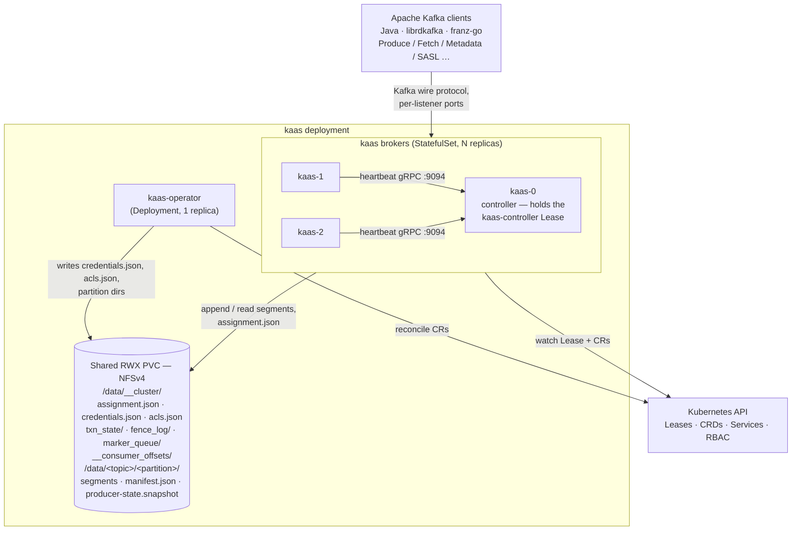

# System overview

The moving parts at a glance: broker pods, the operator, the shared RWX PVC, the Kubernetes API — and where Apache Kafka clients plug in.

Kubernetes is the only control plane — there is no peer gossip protocol and no
replicated state machine. Three deliberate divergences from Apache Kafka: no
KRaft (controller election is a Kubernetes Lease), no replication/ISR
(single-writer-per-partition on shared storage), and no `__transaction_state`
internal topic (slot-sharded JSON files on the shared volume).
