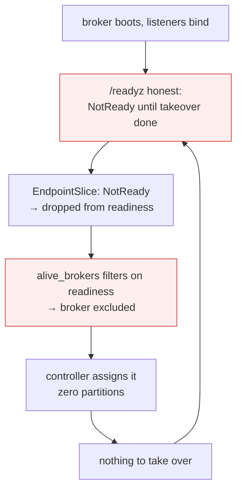
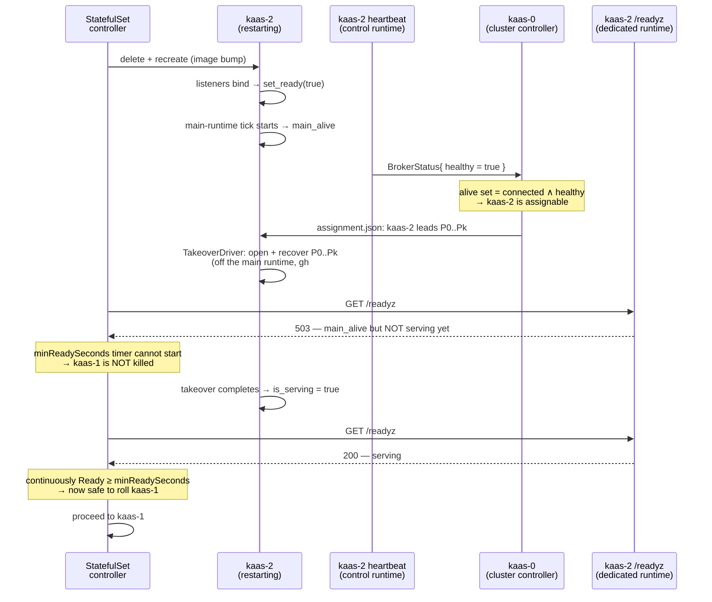

# Honest readiness & rollout pacing

`/readyz` answers one question: **is this broker serving the partitions it
was assigned?** Getting that answer right is what lets a StatefulSet rolling
update pace itself — and getting it *wrong* is what let two brokers go out of
service at once (gh #208) and let a wedged broker sit undetected for 25
minutes (gh #211).

## Two signals, not one

A booting broker and a wedged broker look identical from the outside: both are
`NotReady`, both are still heartbeating. They demand opposite treatment — the
booting one must be *kept* (so it can take over), the wedged one *evicted* (so
its partitions move). No single readiness bit separates them, so the broker
publishes two:

| signal | means | computed from | consumed by |
|---|---|---|---|
| **`serving`** | takeover of every assigned partition is complete | `assignment.json` ∩ engine's open partitions (`is_serving`) | `/readyz` |
| **`healthy`** | the main (request) runtime is still scheduling tasks | a 1 s liveness tick on the main runtime (`main_alive`) | the controller's alive set, via the heartbeat |

The crucial subtlety: **`serving` cannot detect a wedge.** When the main
runtime seizes up — the gh #209/#210 failure, both workers pinned on a
synchronous NFS scan under a 2-CPU limit — the partitions stay *open* in the
engine, so `is_serving` still reads `true`. The thing that actually dies is the
runtime's ability to run tasks, which is exactly what the `healthy` tick
measures: no worker free to bump the tick → it goes stale → `main_alive()` is
`false`.

```
/readyz = listeners-bound
        AND main_alive()                 (not wedged)
        AND (cluster ? serving : true)   (takeover complete)
```

`/readyz` (and `/healthz`) are served from a **dedicated thread and runtime**,
never the main runtime they report on. That is what makes the wedge
observable: the handler can still answer while the main runtime is pinned, and
it answers *unready*, because the liveness tick it reads has gone stale.

## The circular dependency, and how `healthy` breaks it

Gating `/readyz` on `serving` looks like it should deadlock, and with the old
alive set it did:



The fix is to make the alive set depend on `healthy`, not readiness. A booting
broker's main runtime *is* running (it is busy taking over), so it reports
`healthy = true` throughout boot and stays assignable — even while its
`/readyz` is deliberately `NotReady`. A wedged broker reports `healthy = false`
and drops out. Readiness is freed to be honest.

`healthy` travels on the heartbeat, which runs on the broker's **control-plane
runtime** — a separate runtime from the main one. That is deliberate: the
heartbeat survives a main-runtime wedge (so the broker can still be *told*
things), which is precisely why `healthy` has to be an explicit bit rather than
"is the heartbeat connected". A connected heartbeat proves the control runtime
is alive; only the tick proves the *main* runtime is.

## A rolling update, end to end



Contrast the wedge case: after the image bump kaas-2's main runtime seizes.
The tick stops, `healthy` flips to `false`, and the controller drops kaas-2
from the alive set and reassigns its partitions to a live peer — in seconds,
off the heartbeat, rather than waiting ~25 minutes for a `tcpSocket` liveness
probe to notice (gh #211). Meanwhile kaas-2's `/readyz`, answered from its
still-responsive dedicated runtime, reports `503`.

## Rolling-upgrade note

`healthy` is trusted unconditionally: a connected broker reporting `false` is
evicted from the alive set. (An earlier sticky `ever_healthy` guard tolerated
images predating proto field 6, which always send the proto3 default `false`;
it was dropped under the pre-v1 no-backcompat policy — see
`docs/RELEASING.md`. Rolling upgrades from a pre-`healthy` image are
unsupported; deploy fresh instead.) Fast failover comes from the heartbeat
*connection* itself — a genuinely dead broker drops its stream and vanishes
from the alive set within a heartbeat — while a wedged one is evicted on its
next `healthy = false` report.

## Belt and braces: `minReadySeconds`

`broker.minReadySeconds` (default 60) makes the StatefulSet wait for that many
seconds of *continuous* readiness before rolling the next pod. With honest
readiness it is a safety margin rather than the mechanism — a readiness flap
during a late-breaking takeover resets the timer and re-paces the rollout for
free.

## Where the code lives

- `crates/kaas-observability/src/health.rs` — `compute_ready`, the
  `record_main_tick`/`main_alive` liveness tick, `RuntimeState::serving`.
- `crates/kaas-broker/src/coordinator.rs` — `is_serving` (assigned ⊆ open).
- `crates/kaas-storage/src/engine.rs` — `open_partition_keys` on the trait.
- `bins/kaas/src/main.rs` — the dedicated health runtime + the main-runtime
  tick task.
- `bins/kaas/src/cluster.rs` — `decide_alive`, the `healthy`-gated alive-set
  policy.
- `crates/kaas-controller/src/heartbeat_server.rs` — per-broker `healthy` /
  `broker_liveness()`.
- `proto/heartbeat.proto` — `BrokerStatus.healthy` (field 6).
