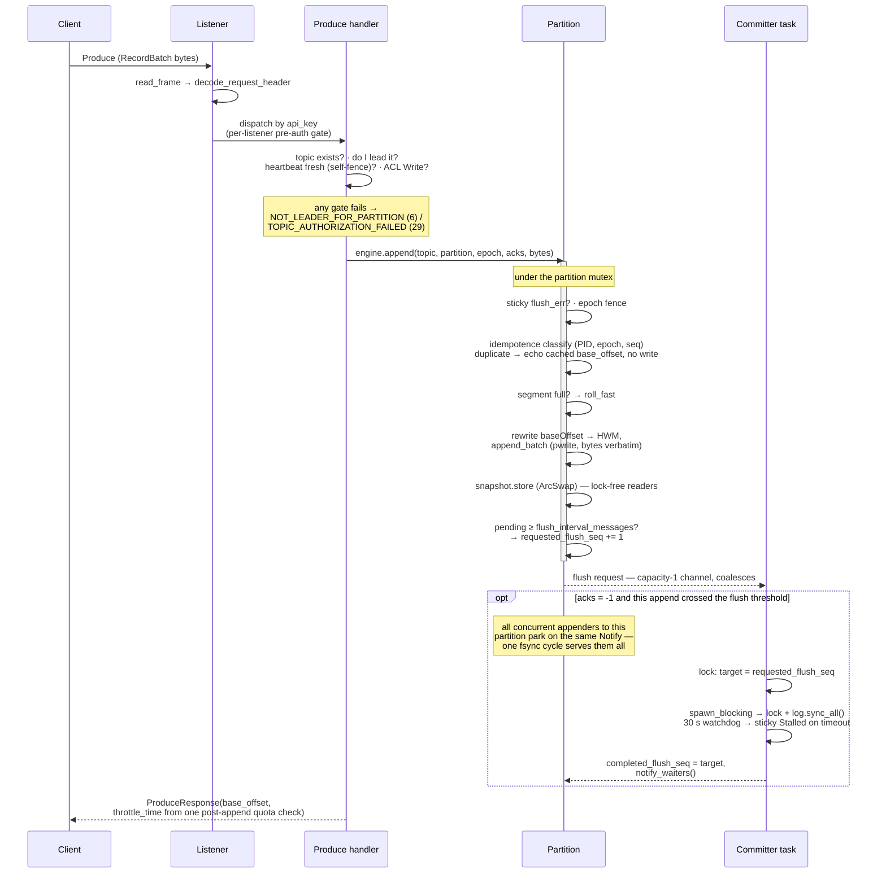
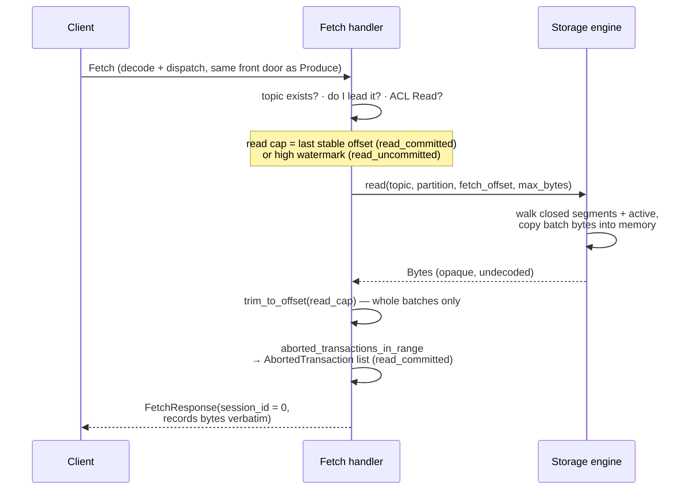
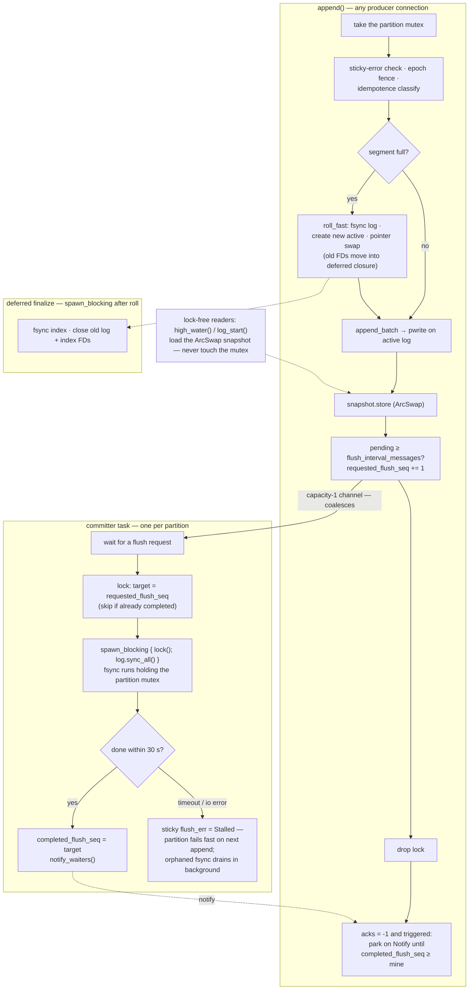

# Storage engine hot path

Group-commit fsync, segment files, the manifest — and how a Produce and a Fetch request travel the broker end to end.

If you know Apache Kafka, you know its produce path leans on two
comfortable assumptions: writes land in the OS page cache, and
durability comes from **replication** — `acks=all` means "on enough
in-sync replicas", not "on disk", which is why almost nobody sets
`log.flush.interval.messages` in production. kaas has neither
assumption available. There are no followers: the only copy of a
partition lives on a shared `ReadWriteMany` volume (the ground rules
for that bet are [the RWX substrate contract](./nfs-substrate.md)), so
`acks=all` has to mean *fsynced to that volume* — and on an NFS-class
mount, every fsync is a COMMIT round-trip over the network. That
round-trip is the dominant cost in the whole broker, and the hot path
is shaped around issuing as few of them as possible: one fsync per
**group** of concurrent batches, an index that is never fsynced on the
hot path, and a manifest that is almost never rewritten.

## A Produce request, end to end



The RecordBatch bytes are never parsed on this path — only two
fixed-size header peeks (producer info for idempotence, offsets for
assignment); the same opaque bytes the client sent land verbatim on
disk. The quota check runs once per request over the summed byte count,
after the appends, and feeds `throttle_time_ms`.

## A Fetch request, end to end



Two response-shape facts:

- **Stateless fetch sessions**: `session_id = 0` on every response —
  Apache's documented contract for "broker doesn't support sessions",
  so clients fall back to full Fetch data per request. KIP-227
  incremental sessions are a future optimisation, not a correctness
  gap.
- **The response is materialized bytes**, copied from the segment
  files; a `sendfile`/splice zero-copy path is a future optimisation
  (the codec keeps records byte-opaque exactly so that a splice path
  stays possible).

## Concurrency model: inside one Partition

What runs under the partition mutex, what the per-partition committer
task does, and what segment roll defers to a background task:



Three properties that make this work:

1. **Group commit**: N concurrent appenders share one fsync cycle — the
   capacity-1 flush channel coalesces requests, and every waiter with
   `flush_seq ≤ completed` wakes on the same `notify_waiters()`.
2. **Lock-free reads**: high-watermark / log-start observation goes
   through the `ArcSwap` snapshot, so a stuck NFS fsync can't stall
   metrics callbacks.
3. **Fsync watchdog**: a hung NFS server trips the 30 s timeout, sets a
   sticky `Stalled` error, and the partition fails fast instead of
   hanging appenders forever.

Note the current committer holds the partition mutex for the fsync
window (readers are unaffected via the ArcSwap; concurrent appenders
queue on the lock). Fsyncing a cloned FD outside the mutex is a known
follow-up, not what ships today.

## On-disk layout

```text
/data/__cluster/                  ── cluster-wide files
    assignment.json
    credentials.json
    acls.json
    txn_state/
        slot-00.json              ── 50 slots, hash(transactional_id) % 50
        ...
    producer_fences/
        from-kaas-0.json          ── one per broker; cross-broker producer
        ...                          epoch fence broadcast
    producer_ids/
        kaas-0.json               ── per-broker producer-ID block high-water
    marker_queue/
        to-kaas-1/                ── per-broker txn marker inbox
            <pid>-<epoch>.json
    __consumer_offsets/
        <group_id>.json           ── per-group offset file

/data/<topic>/
    .config.json                  ── operator-written; retention / segment
                                     bytes / compaction knobs
    .topic-id.json                ── topic-incarnation stamp (see the
                                     substrate contract chapter)

/data/<topic>/<partition>/
    manifest.json                 ── { epoch, highWatermark, logStartOffset }
    producer-state.snapshot       ── idempotent-producer dedupe window
    recovery-checkpoint.json      ── fsynced-prefix hint (see below)
    00000005-00000000000000000000.log   ── epoch=5, base_offset=0
    00000005-00000000000000000000.index ──   8-byte (rel_offset, file_pos)
    00000005-00000000000000001000.log   ── epoch=5, base_offset=1000
    ...
```

`__cluster/` is the cluster-state directory — kaas's file-shaped
replacement for Kafka's internal topics. It can live on its own volume,
separate from topic data; see
[the RWX substrate contract](./nfs-substrate.md).

Each segment is a pair of files; the filename carries both the **leader
epoch** and the **base offset**, so a stale ex-leader's writes can
never physically collide with a new leader's segment:

```text
{epoch:08x}-{base_offset:020d}.log     ── append-only log of v2 RecordBatches
{epoch:08x}-{base_offset:020d}.index   ── sparse offset index, 8 bytes/entry
```

The manifest is written on partition open (takeover routes through
open) and on close/relinquish — **not** on segment roll and not per
append — so its `highWatermark` can lag in-memory state; recovery
treats the log as authoritative and reconciles on open by scanning the
active segment to the first malformed batch boundary. Who runs that
recovery, and when, is the next chapter —
[file-handle ownership & takeover](./file-handles.md).

### Recovery checkpoint — scanning only the tail

Re-scanning the whole active segment on every takeover is the dominant
cost of broker startup on NFS (O(active segment) at the substrate's
read bandwidth). A per-partition **recovery checkpoint** — Kafka's
recovery-point idea — bounds it. `recovery-checkpoint.json` records
`{segment_base, byte_pos, high_watermark}`: everything up to `byte_pos`
of the named active segment is fsynced, with that log-end-offset. The
committer refreshes it once the fsynced log grows a threshold (64 MiB)
past the last one, and a clean close writes it at EOF. On open,
recovery resumes the scan from `byte_pos` instead of byte 0 whenever
the checkpoint still names the current active segment; if it doesn't (a
roll happened since, or the file is missing/stale/truncated) it falls
back to a full scan — always correct, and cheap with a bounded segment
size.

The clean-shutdown fast path falls out for free and on **one** code
path: a graceful close leaves the checkpoint at EOF, so "scan from
checkpoint to EOF" reads zero bytes — the same path a crash takes,
which scans only the gap. The checkpoint is a pure optimization hint:
because a missing or wrong one just triggers a full scan, it never has
to be correct, only usually-present.

The index is **sparse**: one `(rel_offset: i32, file_pos: i32)` entry
every `index.interval.bytes` of log data (4 KiB default). Lookup
binary-searches to the closest entry ≤ the target offset, then scans
the log forward. The index is *not* fsynced on the hot path — it's
rebuildable from the log during takeover recovery, so only the log's
durability is on the `acks=all` promise.

## Byte opacity: the broker never parses records

Exactly three places on the Produce path touch the RecordBatch bytes,
and none of them decodes a record:

1. The request decoder carries the records as an opaque, zero-copy
   slice into the frame buffer.
2. The idempotence check peeks the fixed-size batch header for producer
   ID / epoch / sequence — header only.
3. The segment append peeks the head for
   `(base_offset, last_offset_delta, max_timestamp)` — header only.

After that, the same opaque bytes the client sent land verbatim on disk
(with the base offset rewritten in place): **the log file IS the wire
format**, which is what makes Fetch a byte copy rather than a
re-encode. Fetch is symmetric — batch bytes come back off disk
undecoded. The invariant is enforced by tripwire counters that must
stay at zero (see [Observability](./observability.md)) and by an
integration test.

## The durability dial

`KAAS_FLUSH_INTERVAL_MESSAGES` (default **1** = honest `acks=all`:
every batch waits for a group-commit fsync cycle) mirrors Apache
Kafka's `log.flush.interval.messages`. Raising it trades durability for
throughput by letting the committer skip cycles until N messages are
pending — same semantics, same trade, as Apache. On NFS substrates
where the COMMIT round-trip dominates, this and the group-commit
coalescing are the two levers that matter (see
[Performance](../operations/performance.md)).

## Retention, DeleteRecords, and compaction — the honest state

Per-topic policy flows from `KafkaTopic.spec.config` through the
operator-written `.config.json` into the broker — but as of today **no
background cleaner runs in production**:

- **`DeleteRecords`** (API key 21) is one of the two working
  reclamation paths: it advances `logStartOffset` and unlinks closed
  segments the purge fully covers (the active segment is never
  reclaimed). Being a leader-side unlink, it actually frees disk per
  the [file-handle ownership rule](./file-handles.md). Topic deletion
  is the other.
- **Size-based retention** exists as code, exercised by its unit tests,
  but is **not instantiated by the broker** — the interval loop its
  docstring promises is an open follow-up, as are time-based retention
  and the compactor.
- **Compaction knobs** `min.compaction.lag.ms` (KIP-58) and
  `delete.retention.ms` (KIP-354) round-trip through CRs and
  DescribeConfigs but gate nothing yet. When the compactor lands,
  tombstone expiry will be **per-batch** (Apache is per-record) — a
  deliberate consequence of never opening batches. Status is tracked
  honestly on the [KIP-58](../compat/kip/kip-58.md) and
  [KIP-354](../compat/kip/kip-354.md) pages.

## Implementation notes (for contributors)

- Issue trail: the group-commit Produce path is gh #80/#81/#82; the
  lock-free ArcSwap read path is gh #134; the 30 s fsync watchdog is
  gh #95; stateless fetch sessions are gh #4; wiring the retention
  cleaner's interval loop is gh #158.
- Byte-opacity peeks: `kaas-storage/src/idempotence.rs` (PID / epoch /
  sequence) and `kaas-storage/src/segment.rs` (offsets / timestamp);
  the codec side is `kaas-codec` decoding
  `records: Option<bytes::Bytes>` as a zero-copy slice. Enforced by the
  tripwire counters and the `bins/kaas/tests/byte_opacity.rs`
  integration test.
- Topic-config plumbing: `crates/kaas-storage/src/topicconfig.rs`. The
  never-instantiated `RetentionCleaner`:
  `crates/kaas-storage/src/cleaner.rs`.
- The producer-fence files and marker queue in the layout above belong
  to the transaction machinery (gh #108 phase 2, gh #175) — see
  [Transactions & idempotence](./transactions.md).
- Index mmap is feature-gated behind `mmap`, the one unsafe-code
  carve-out in the workspace.
