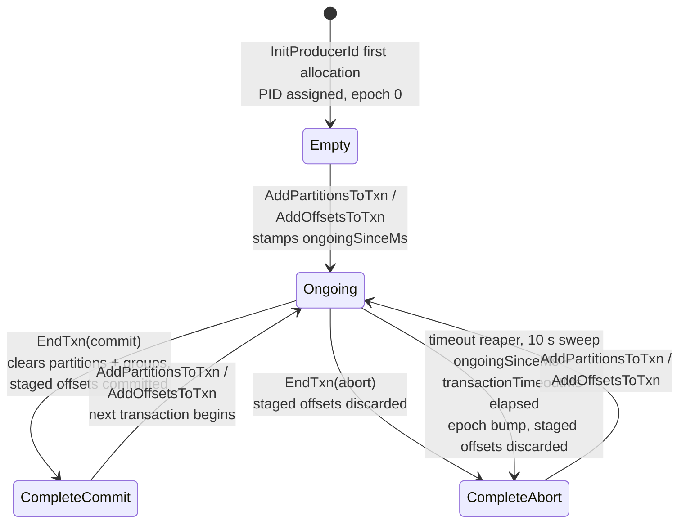
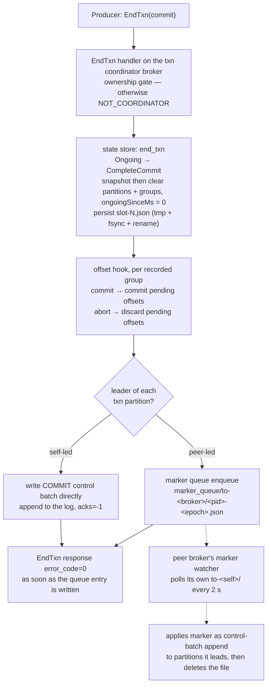

# Transactions & idempotence

Idempotent-producer dedupe, the transaction coordinator state machine on slot-sharded JSON files, and EOS v2 end to end.

In Apache Kafka, exactly-once rests on two pieces of broker machinery:
per-partition producer state (the idempotence dedupe window) and a
transaction coordinator whose state lives in the internal
`__transaction_state` topic. kaas keeps the first nearly verbatim and
replaces the second: there is no `__transaction_state` topic. Like
`__consumer_offsets`
([Consumer-group coordination](./consumer-groups.md)), it is an
internal topic replaced by plain JSON files on the shared volume — the
third substitution from the [introduction](../introduction.md).

None of this is exotic. The Java producer has enabled idempotence by
default since Kafka 3.0, so *every* `kafka-console-producer` invocation
exercises this machinery — it's hot-path, not an opt-in feature. Four
layers of state, all on the shared volume:

| Layer | Where it lives |
|---|---|
| PID allocation (`InitProducerId`) | a persisted block allocator, one file per broker under `/data/__cluster/producer_ids/`; transactional IDs get the same PID + `epoch+1` on rejoin |
| Per-partition dedupe | a 5-batch ring per PID, held in memory under the partition mutex |
| Snapshot persistence | `producer-state.snapshot` next to the partition manifest |
| Per-`transactional.id` state | slot-sharded `/data/__cluster/txn_state/slot-N.json` |

## Idempotent producer

`InitProducerId` (key 22) hands a non-transactional producer a fresh PID
at epoch 0. On every Produce, classification runs **under the partition
mutex, before append** against a per-PID ring of the last 5 batches —
mirroring the Java client's `max.in.flight.requests.per.connection=5`:

- **duplicate** → echo the cached `baseOffset`, no log write;
- **out-of-order sequence** → error 45 (`OUT_OF_ORDER_SEQUENCE_NUMBER`);
- **stale epoch** → error 47 (`PRODUCER_FENCED`);
- otherwise accept and advance the ring.

The ring survives leadership moves via `producer-state.snapshot`
(written on segment roll + relinquish, restored on take-over — see
[File-handle ownership](./file-handles.md)).

### PIDs are never reused

The dedupe ring is keyed by `(PID, epoch)`, so handing the same PID to
two different producers is not a cosmetic collision — the second one
inherits the first one's sequence history. Its batches are then either
**silently dropped** (sequence range matches a cached batch → classified
duplicate, stale base offset echoed, produce "succeeds", consumers read
nothing) or **rejected** with `OUT_OF_ORDER_SEQUENCE_NUMBER`. Both
failure modes have been observed in practice.

Apache Kafka draws PIDs from a global counter whose next block is
persisted (ZooKeeper's `/latest_producer_id_block`, KRaft's
`ProducerIdsRecord`). kaas has no metadata quorum (a stated
[non-goal](../compat/non-goals.md)), so it partitions the PID space by
broker ordinal instead:

```text
pid = (broker_id + 1) * 2^40 + local
```

Each broker is the single writer of its own slice *and* of its own
block file `/data/__cluster/producer_ids/kaas-<id>.json`, so there is
no cross-broker read-modify-write on the shared volume. `local`
advances in blocks of 1000, and the block end is persisted (tmp +
fsync + rename) **before** any PID in it is handed out — a crash can
only skip PIDs forward, never rewind. The `+ 1` keeps broker 0 clear of
the low PIDs an earlier in-memory allocator handed out, so an upgrade
can't collide with producer state already on the volume.

### Fencing across partitions and brokers

A transactional producer that reconnects gets the **same PID with
`epoch+1`** — fencing is the monotonic epoch, exactly Apache's KIP-360
contract. Two mechanisms make the bump stick everywhere:

- **Cross-partition fence**: after every `epoch > 0` rejoin, the
  InitProducerId handler walks every local partition, advances the
  PID's epoch and clears its dedupe window — so a zombie batch from the
  old session is fenced even on partitions the new session hasn't
  touched yet.
- **Cross-broker fence broadcast**: the bump is appended to a
  per-broker fence log under `/data/__cluster/producer_fences/`; every
  peer polls the logs and applies the bumps it hasn't seen. Same
  shared-volume pattern as the marker queue below — no new RPC surface.

## Transaction state machine

Per-`transactional.id` state is slot-sharded across
`/data/__cluster/txn_state/slot-N.json` (50 slots,
`fnv1a(transactional.id) % 50` — the same 50 Apache Kafka defaults to
for `transaction.state.log.num.partitions`). The states a transaction
actually visits:



Facts the diagram compresses:

- The state enum also carries `PrepareCommit` / `PrepareAbort` variants
  for forward compatibility, but kaas never visits them: `EndTxn`
  collapses prepare-then-complete into one atomic slot-file transition.
- `InitProducerId` on a **rejoin** does not reset the state: the entry
  keeps the same PID and bumps `epoch += 1` — fencing is purely the
  monotonic epoch. Only epoch overflow (`i16::MAX`) allocates a fresh
  PID and resets to `Empty`.
- A retried `EndTxn` in the matching `Complete*` state is answered
  idempotently (no second transition); a direction mismatch returns
  `INVALID_TXN_STATE`, and `EndTxn` on `Empty` is `INVALID_TXN_STATE`
  too. Epoch mismatches return `PRODUCER_FENCED` everywhere.

## EndTxn: commit flow

Cross-broker marker dispatch goes through a queue on the shared volume —
there is **no** WriteTxnMarkers RPC between brokers. `EndTxn` returns
success as soon as the queue entry is durably written; peer brokers
apply markers asynchronously.



Self-led markers are written *before* the queue entries, so a
coordinator crash mid-dispatch never loses the local marker. A retried
`EndTxn` overwrites the same `{pid}-{epoch}.json` file — the queue is
idempotent by naming. Consumers in `read_committed` only see the
transaction's records once these markers land (the fetch path clamps to
the last stable offset).

## Coordinator routing and staged offsets

Which broker coordinates a transaction is the same deterministic hash
story as consumer groups: `hash(transactional.id)` picks the slot
owner, and non-coordinators answer the txn APIs with `NOT_COORDINATOR`
— see [Consumer-group coordination](./consumer-groups.md). On
coordinator failover the new owner simply reads the same slot file off
the shared volume: close-to-open consistency means the file *is* the
materialized state, with no log replay — this is the architectural
replacement for Apache's `__transaction_state` topic.

`TxnOffsetCommit` (key 28) stages consumer offsets in a **pending**
layer keyed by `(group ID, PID)` in the offset store — invisible to
`OffsetFetch` until `EndTxn` commits. `AddOffsetsToTxn` (key 25)
records which groups the transaction will touch, so the EndTxn offset
hook knows exactly which pending sets to commit or discard. That hook
firing atomically with the state transition is the KIP-447 (EOS v2)
contract.

## The timeout reaper

The transaction timeout reaper fires every 10 s — Apache's
`transaction.abort.timed.out.transaction.cleanup.interval.ms` default.
Any `Ongoing` entry past `ongoingSinceMs + transactionTimeoutMs`
transitions to `CompleteAbort` with an epoch bump, and its staged
offsets are discarded via the same offset hook.

One honest caveat: the state store has an ownership-gated variant of
the sweep, but the production reaper runs the **ungated** one — in a
multi-broker cluster every broker's reaper walks every slot, so N
brokers can race on the same overdue transaction. Gating the reaper on
coordinator ownership is the intended end state, not what ships today;
treat multi-broker reaper behaviour as a known sharp edge.

## Implementation notes (for contributors)

- Dedupe ring: `crates/kaas-storage/src/idempotence.rs`
  (`ProducerStates`); snapshot persistence:
  `crates/kaas-storage/src/producer_snapshot.rs`.
- PID block allocator: `crates/kaas-broker/src/producer_id.rs`
  (gh #219 — both the silent-drop and the `OUT_OF_ORDER` symptoms of
  PID reuse were seen there; the pre-fix allocator was an in-memory
  `AtomicI64`).
- Fence-on-rejoin contract: gh #22. Cross-broker fence broadcast
  (gh #108 phase 2): fence log in
  `crates/kaas-coordinator/src/fence_log.rs`, applied by each peer's
  `FenceWatcher` (`crates/kaas-broker/src/fence_watcher.rs`).
- Txn state store + slot sharding:
  `crates/kaas-coordinator/src/txn_state.rs` — the architectural answer
  to gh #29 (no literal `__transaction_state` topic).
- Marker queue: gh #175. Txn-slot hash ownership: gh #91.
- The reaper is spawned by the broker's cluster runtime
  (`bins/kaas/src/cluster.rs`); the ownership-gated sweep variant is
  `abort_overdue_owned` — wiring it in is the open follow-up.
- The full KIP-447 consume-process-produce-commit round trip runs
  against an in-process broker in `bins/kaas/tests/eos_v2.rs`.
