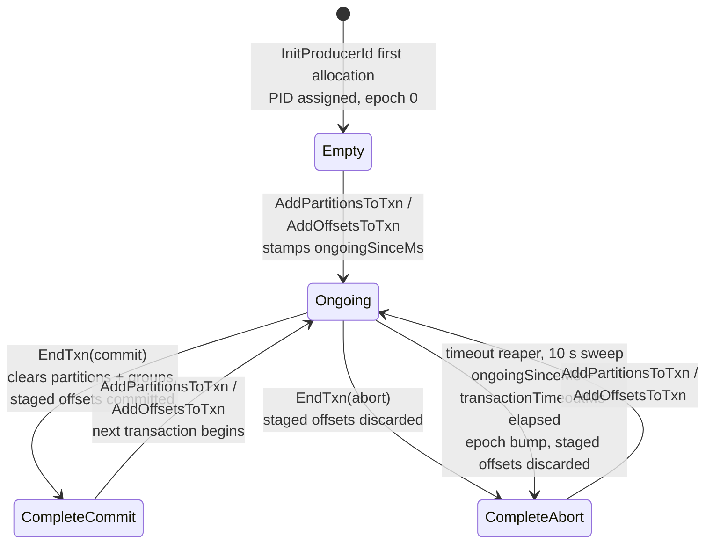
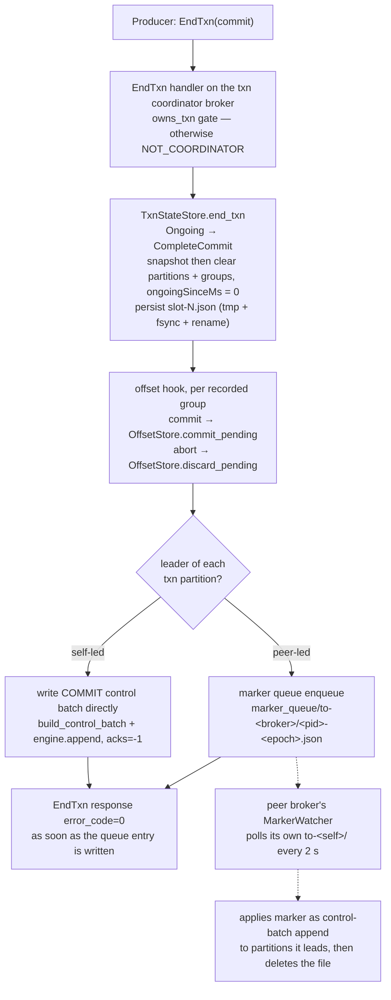

# Transactions & idempotence

Idempotent-producer dedupe, the transaction coordinator state machine on slot-sharded JSON files, and EOS v2 end to end.

## Transaction state machine

Per-`transactional.id` state lives in `TxnEntry` records
(`crates/kaas-coordinator/src/txn_state.rs`), slot-sharded across
`/data/__cluster/txn_state/slot-N.json` (50 slots,
`fnv1a(transactional.id) % 50`). The states a transaction actually visits:

Facts the diagram compresses (all from `txn_state.rs`):

- The `TxnState` enum also carries `PrepareCommit` / `PrepareAbort` variants for
  forward compatibility, but kaas never visits them: `end_txn` collapses
  prepare-then-complete into one atomic slot-file transition.
- `InitProducerId` on a **rejoin** does not reset the state: the entry keeps the
  same PID and bumps `epoch += 1` — fencing is purely the monotonic epoch. Only
  epoch overflow (`i16::MAX`) allocates a fresh PID and resets to `Empty`.
- A retried `EndTxn` in the matching `Complete*` state is answered idempotently
  (no second transition); a direction mismatch returns `INVALID_TXN_STATE`, and
  `EndTxn` on `Empty` is `INVALID_TXN_STATE` too. Epoch mismatches return
  `PRODUCER_FENCED` everywhere.

## EndTxn: commit flow

Since gh #175, cross-broker marker dispatch goes through a shared-PVC queue —
there is **no** WriteTxnMarkers RPC between brokers. `EndTxn` returns success as
soon as the queue entry is durably written; peer brokers apply markers
asynchronously.

Self-led markers are written *before* the queue entries, so a coordinator crash
mid-dispatch never loses the local marker. A retried `EndTxn` overwrites the
same `{pid}-{epoch}.json` file — the queue is idempotent by naming. Consumers
in `read_committed` only see the transaction's records once these markers land
(the fetch path clamps to the last stable offset).

The transaction timeout reaper (spawned by the broker's cluster runtime) fires
every 10 s: any `Ongoing` entry past `ongoingSinceMs + transactionTimeoutMs`
transitions to `CompleteAbort` with an epoch bump, and its staged offsets are
discarded via the same offset hook.
