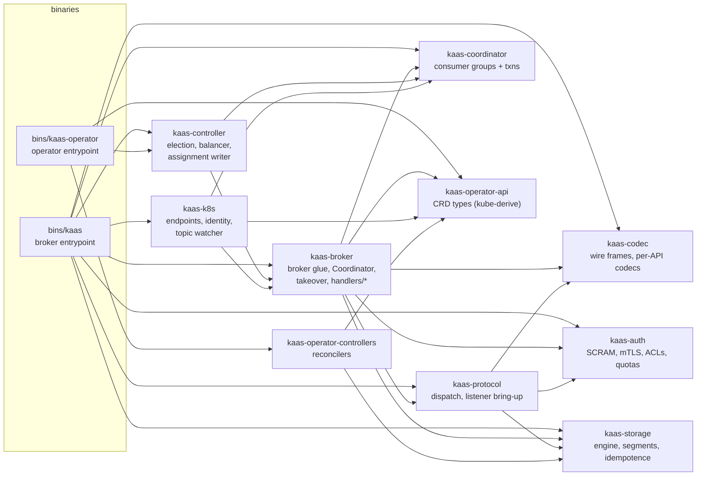

# Workspace layout & crate dependency graph

Twelve library crates, two binaries, and an xtask runner — who depends on whom, and why the layering looks the way it does.

## Crate dependency graph

An arrow reads "depends on". Verified against each crate's `Cargo.toml`
`[dependencies]` (runtime deps only, dev-dependencies excluded).

Two crates are left off the diagram to keep it readable:

- **`kaas-observability`** is depended on by every crate above except
  `kaas-codec` and `kaas-operator-api` (and by both bins); its own single
  dependency is `kaas-codec`, for the byte-opacity tripwire counters.
- **`kaas-test-harness`** depends on nothing in the workspace — it carries the
  byte-opacity test fixtures and the `recordbatch` helper, the only place a
  decoded-record representation is allowed to live.

> This graph is hand-maintained (checked against `Cargo.toml` on 2026-07-19).
> Auto-generating it from `cargo metadata` is a possible future
> `gen-api-matrix`-style xtask.
